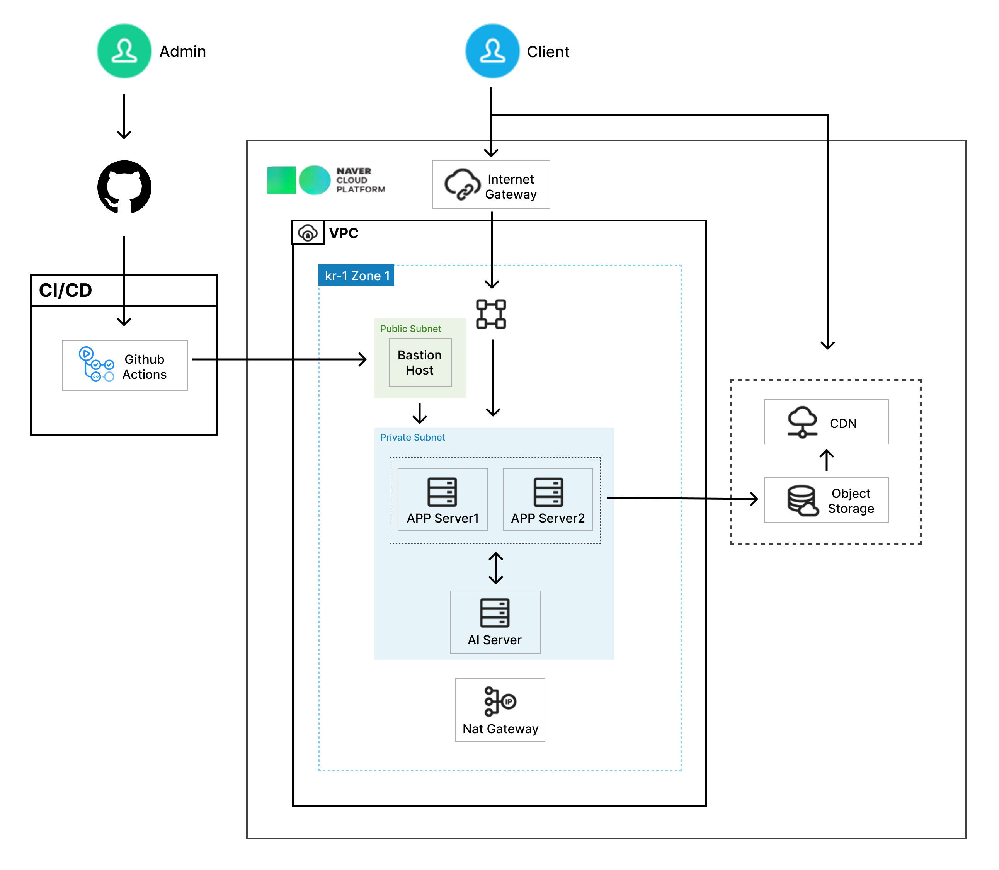
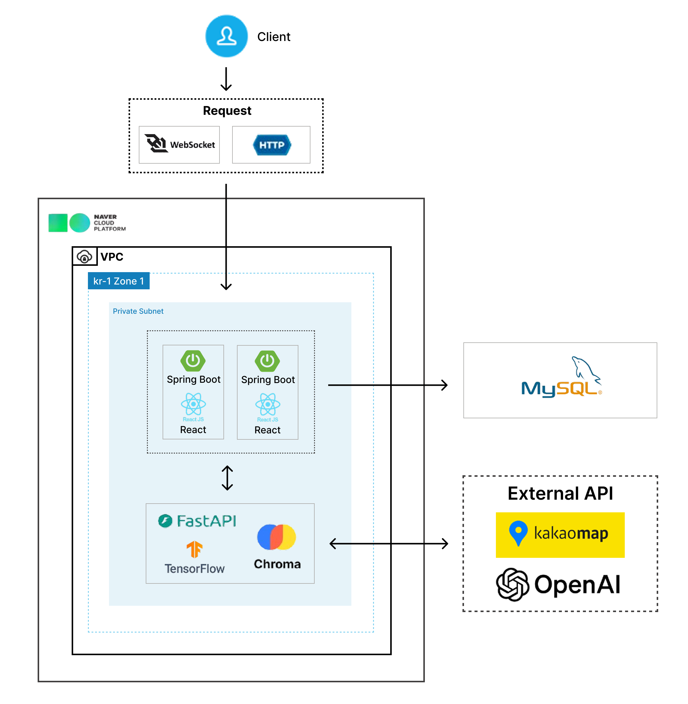

# 🤖 2025-실전-Project: Eum Platform

---


> **이움**은 AI 기반 작물 진단과 농사 가이드로 실시간으로 농사 정보를 제공하고, 농장 커뮤니티와 실시간 채팅으로 농장 참여자들을 연결합니다. **이움**과 함께 게임처럼 즐겁게 도시농업을 시작하세요!

## 1. 📌 프로젝트 개요

---

- **도시농업 지원 AI·커뮤니티 통합 플랫폼 – '이움(Eum)'**
- AI로 작물을 진단하고 농사 정보를 제공하며, 농장 커뮤니티로 참여자를 연결하는 플랫폼

> **배경**: 홈가드닝·반려식물 소비가 크게 증가하며 식물 재배에 대한 관심과 긍정적 인식이 이미 형성되어 있습니다. 그러나 실외 텃밭과 같은 본격적인 도시농업으로 확장하는 과정에서 정보 부족, 병해 대응 어려움, 접근성 한계, 시간 부담 등 다양한 장벽에 직면합니다. 기존 도시농업 관련 서비스가 딱딱하고 재미 요소가 부족한 점도 실제 참여로 이어지지 못하는 주요 요인입니다.  
> **목표**: AI로 작물 문제를 해결하고, 농장 커뮤니티에서 정보를 교류하며, 게임 같은 재미 요소로 쉽게 도시농업을 시작하고 지속할 수 있는 환경을 만들고자 합니다.  
> **기대 효과**: AI 기반 농사 정보 제공 기능으로 초보자도 스스로 문제를 해결하며 지속적인 농사 경험을 쌓을 수 있고, 농장 커뮤니티를 통해 참여자 간 교류를 촉진하여 도시 공동체성을 강화할 수 있습니다.

### 기술스택

- **Frontend**: 
  
  
  
  
  
  
- **Backend**: 
  
  
  
  
  
  
- **AI Server**: 
  
  
  
  
  
- **도구**: 
  
  
  

## 2. 🚀 배포

---

### 인프라 아키텍처

<div align="center">
  
</div>

### 소프트웨어 아키텍처

<div align="center">
  
</div>

<br>

- **배포 환경**: Naver Cloud Platform
- **CI/CD**: GitHub Actions
- **특징**:
  - Frontend, Backend, AI Server 각각 독립 배포
  - GitHub Actions를 통한 자동 빌드 및 배포
  - Naver Cloud 서버 환경에서 운영

## 3. ⚙️ 설치 및 실행 방법

---

### 사전 준비

- **Node.js** (v18 이상)
- **Java** (JDK 21)
- **Python** (3.10 이상)
- **MySQL** (8.0 이상)

### 1️⃣ Frontend 실행

```bash
cd frontend

# 패키지 설치
npm install

# 환경 변수 설정 (.env 파일 생성)
# VITE_API_BASE_URL=http://localhost:8080  (Spring Boot 백엔드 서버 주소)
# VITE_KAKAO_MAP_API_KEY=your_kakao_api_key  (카카오맵 API 키)

# 개발 서버 실행
npm run dev
```

### 2️⃣ Backend 실행

```bash
cd backend

# application.properties 파일을 본인 환경에 맞게 수정
# - MySQL 연결 정보 (localhost, port, DB명, username, password)
# - OAuth2 클라이언트 ID/Secret (Google 소셜 로그인, 필요시)
# - Object Storage 설정 (Naver Cloud Platform, 필요시)

# Gradle 빌드 및 실행
./gradlew bootRun
```

### 3️⃣ AI Server 실행

```bash
cd ai

# Python 가상환경 생성 (권장)
python -m venv venv
source venv/bin/activate  # Windows: venv\Scripts\activate

# 라이브러리 설치
pip install -r requirements.txt

# 환경 변수 설정 (.env 파일 참고)
# OPENAI_API_KEY=your_api_key_here

# AI 서버 실행
uvicorn main:app --host 0.0.0.0 --port 8000 --reload

# 또는 제공된 스크립트 사용
chmod +x start_server.sh
./start_server.sh
```

### 🚀 로컬 실행 순서

1. **MySQL 서버** 시작
2. **Backend** 실행 (포트 8080)
3. **AI Server** 실행 (포트 8000)
4. **Frontend** 실행 (포트 5173)
5. 브라우저에서 `http://localhost:5173` 접속

## 4. 📂 프로젝트 구조

---

```arduino
weconnect/
│
├── frontend/                # React 기반 프론트엔드
│   ├── src/
│   │   ├── api/            # API 통신 모듈
│   │   ├── pages/          # 페이지 컴포넌트
│   │   ├── contexts/       # React Context (전역 상태)
│   │   ├── assets/         # 이미지, 폰트 등 정적 파일
│   │   ├── data/           # 로컬 데이터
│   │   ├── App.jsx         # 메인 App 컴포넌트
│   │   └── main.jsx        # 진입점
│   ├── package.json
│   └── vite.config.js
│
├── backend/                # Spring Boot 기반 백엔드
│   └── src/main/java/com/project/eum/
│       ├── ai/             # AI 서버 연동
│       ├── chat/           # 채팅 기능 (WebSocket)
│       ├── diagnosis/      # 작물 진단 기록
│       ├── diary/          # 재배 일기
│       ├── farm/           # 농장 관리
│       ├── post/           # 커뮤니티 게시글
│       ├── comments/       # 댓글
│       ├── replies/        # 답글
│       ├── shop/           # 상점 아이템
│       ├── user/           # 회원 관리
│       ├── security/       # 인증/인가 (OAuth2)
│       ├── config/         # 설정 파일
│       ├── dto/            # 데이터 전송 객체
│       └── util/           # 유틸리티
│
└── ai/                     # FastAPI 기반 AI 서버
    ├── main.py             # FastAPI 진입점
    ├── rag_service.py      # RAG 기반 농사정보 검색
    ├── text_suggestion_service.py  # 텍스트 추천
    ├── local_predict.py    # YOLO 작물 진단
    ├── models/             # AI 모델 저장
    ├── chroma_db_v1/       # 벡터DB 저장소
    └── requirements.txt    # Python 패키지
```

### Frontend

- `api/`: Axios 기반 백엔드 API 통신 함수 모음
- `pages/`: 재배일기, 작물진단, 농사정보챗봇, 커뮤니티 등 주요 페이지
- `contexts/`: 코인 시스템 등 전역 상태 관리

### Backend

- `chat/`: WebSocket 기반 실시간 채팅 기능
- `diagnosis/`: 작물 진단 내역 저장 및 조회
- `diary/`: 재배 일기 CRUD
- `farm/`: 농장 등록, 회원 승인 관리
- `post/`, `comments/`, `replies/`: 커뮤니티 게시판
- `security/`: OAuth2 소셜 로그인, JWT 인증
- `shop/`: 코인으로 구매 가능한 아이템 관리

### AI Server

- `rag_service.py`: ChromaDB 기반 농업 정보 RAG 검색
- `text_suggestion_service.py`: 공지사항 작성 시 AI 문장 추천
- `local_predict.py`: YOLO 모델로 작물 병해충 진단

## 5. 👥 팀 소개

---

> 게임 스타일 디자인과 AI 기반 농사 정보 제공, 농장 참여자 간 소통 지원을 통해 농사 활동을 지속적으로 이어가도록 돕는 것을 목표로 합니다.

### 멤버 소개

---

|                                                  임진서                                                  |            김민재            |                                                     김철용                                                     |                                                   이영빈                                                   |                                               진영서                                               |
| :------------------------------------------------------------------------------------------------------: | :--------------------------: | :------------------------------------------------------------------------------------------------------------: | :--------------------------------------------------------------------------------------------------------: | :------------------------------------------------------------------------------------------------: |
| <a href="https://github.com/jsim-svg919"></a> |                              | <a href="https://github.com/KIM-CHEOL-YONG"></a> | <a href="https://github.com/dldudqls7788"></a> | <a href="https://github.com/Yong0-sa"></a> |
|                                            PM<br>RAG Engineer                                            | Data Engineer<br>DB Designer |                                            Backend Dev<br>DB Admin                                             |                                         AI Engineer<br>Backend Dev                                         |                                  Frontend Dev<br>DevOps Engineer                                   |

## 6. 📎 참고 자료 및 산출물

---

- 📘 **최종 기획서**: [다운로드](https://drive.google.com/file/d/1r-igEm5rH4EXguDtSA7aBgUoD50Yqnnj/view?usp=sharing)
- 📽️ **발표자료 (PPT)**: [다운로드](https://drive.google.com/file/d/1Hgv__uSKvIcGBbNXhE-uS1NUE0cW6XMM/view?usp=sharing)
- 🗂️ **팀원별 협업 일지**
  - [임진서 협업일지](https://www.notion.so/sdtunit032526/270ae0eec955800a9af8ec9762d979eb?source=copy_link)
  - [김민재 협업일지](https://www.notion.so/sdtunit032526/270ae0eec955800ba797f69f54bade64?source=copy_link)
  - [김철용 협업일지](https://www.notion.so/sdtunit032526/270ae0eec95580599209eda725ce1d91?source=copy_link)
  - [이영빈 협업일지](https://www.notion.so/sdtunit032526/270ae0eec9558061bf03f5dcf1eab933?source=copy_link)
  - [진영서 협업일지](https://www.notion.so/sdtunit032526/270ae0eec955806eb151dbbdaeafc545?source=copy_link)

## 7. 📄 사용한 모델 및 라이센스

---

### AI 모델

- **Ultralytics YOLO11n**: AGPL-3.0 License (오픈소스, 상업적 사용 시 라이센스 준수 필요)
  - 용도: 작물 병해충 진단 (사과, 토마토, 포도)
- **OpenAI text-embedding-3-small**: OpenAI API 전용 (상업적 사용 가능, API 기반)
  - 용도: RAG 기반 농업 정보 검색을 위한 텍스트 임베딩
- **OpenAI GPT-5**: OpenAI API 전용 (상업적 사용 가능, API 기반)
  - 용도: 농사정보 질의응답 생성 및 공지사항 작성 문장 추천

### 데이터베이스 & 라이브러리

- **ChromaDB**: Apache 2.0 License (상업적 사용 가능)
- **PyTorch**: BSD License (상업적 사용 가능)
- **Spring Boot**: Apache 2.0 License (상업적 사용 가능)
- **React**: MIT License (상업적 사용 가능)
